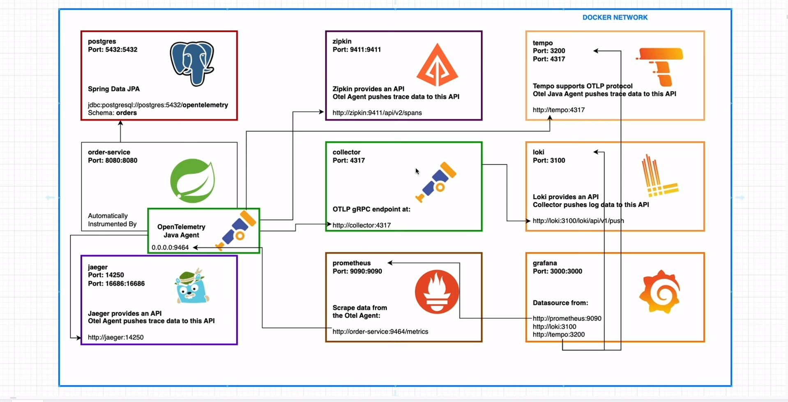

# Project README

## Introduction

This project is a Java application built using Maven and packaged as a Docker image. It demonstrates the integration of these technologies to create a robust and portable software solution.

## Prerequisites

To run this project, you will need the following:

* Java Development Kit (JDK) 11 or higher
* Apache Maven 3.8 or higher
* Docker Desktop

## Getting Started

1. Clone the project repository:
git clone https://github.com/your-username/project-name.git
2. Navigate to the project directory:
cd project-name
3. Build the project using Maven:
mvn clean install
4. Build the Docker image:
docker build -t project-name .
5. Run the Docker container:
docker run -p 8080:8080 project-name
The application will be accessible at `http://localhost:8080`.

## Project Structure

The project is structured as follows:

* `src/main/java`: Contains the Java source code for the application.
* `src/test/java`: Contains the unit tests for the application.
* `pom.xml`: The Maven project configuration file.
* `Dockerfile`: The Docker image build configuration file.
* `README.md`: This file.

## Contributing

We welcome contributions to this project. Please read the CONTRIBUTING.md file for more information on how to contribute.

## License

This project is licensed under the MIT license. See the LICENSE file for more information.